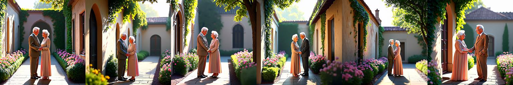

<div id="top" align="center">

# PromptMoG: Prompt Embedding MoG Sampling

**A plug-and-play framework for enhancing diversity in long-prompt image generation**

Bo-Kai Ruan, Teng-Fang Hsiao, Ling Lo, Yi-Lun Wu, Hong-Han Shuai

<a href="http://arxiv.org/abs/2511.20251">"></a>
<a href="#license">
  
</a>

</div>

|                         CogView4                         |
| :------------------------------------------------------: |
|  |
|                  **+PromptMoG (Ours)**                   |
|        |
|                        +CADS                         |
|             |
|                     +DiverseFlow                     |
|        |

|                       Qwen-Image                       |
| :----------------------------------------------------: |
|  |
|                 **+PromptMoG (Ours)**                  |
|          |
|                       +CADS                        |
|               |
|                    +DiverseFlow                    |
|          |

>[!NOTE]
> We provide the python package for LPD-Bench evaluation. Please check the [`lpd-eval` branch](https://github.com/basiclab/prompt_mog/tree/lpd-eval) for more details.

## 📦 Installation

```bash
# Clone the repository
git clone https://github.com/basiclab/prompt_mog.git --depth 1 && cd prompt_mog

# Install the dependencies
uv sync

# load environment
source .venv/bin/activate

# If users want to compute the dataset statistics, download the spacy model
uv run spacy download en_core_web_sm
```

## 🗃️ Data Preparation

We have provided the filtered dataset in `data/lpd_bench`. Users can also follow the following steps to generate the dataset themselves.

### Creating LPD-Bench

To generate the long prompts similar to `LPD-Bench`, run the following command:

```bash
# Step 1: Generate a pool of long prompts
python misc/dataset_gen/generate_long_prompt.py --num-prompts-for-topic 60

# Step 2: Filter the prompts
python misc/dataset_gen/post_process_data.py --data-root data/lpd_bench --num_prompts_per_topic 60 --num_remain_per_topic 40
```

The outputs will be saved to `data/lpd_bench/filtered`.

Users can also run the statistics of the dataset by running the following command:

```bash
python misc/dataset_gen/data_statistics.py --data-root-dir data --plot 
```

The results will be saved to `assets/dataset_statistics.pdf`.

### Creating LPD-Bench-Rewritten

To rewrite the long prompts, run the following command:

```bash
python misc/rewrite_long_prompt.py \
    --data_folder data/lpd_bench/filtered \
    --output_folder data/lpd_bench/rewritten \
    --num_variants 10 \
    --model gpt-4o \
    --workers 8
```

The outputs will be saved to `data/lpd_bench/rewritten`.

## 🚀 Usage

### Diversity Test

```bash
# Generate images
./scripts/gen_image.sh \
    --dataset_type long \
    --prompt_root_dir data/lpd_bench \
    --output_root_dir outputs/long_prompt
./scripts/gen_image.sh \
    --dataset_type short \
    --prompt_root_dir data/lpd_bench \
    --output_root_dir outputs/short_prompt_1 \
    --first_top 1
./scripts/gen_image.sh \
    --dataset_type short \
    --prompt_root_dir data/lpd_bench \
    --output_root_dir outputs/short_prompt_3 \
    --first_top 3

# Score the diversity
./scripts/scoring_diversity.sh --output_root_dir outputs/long_prompt
./scripts/scoring_diversity.sh --output_root_dir outputs/short_prompt_1
./scripts/scoring_diversity.sh --output_root_dir outputs/short_prompt_3
```

### Prompt-MoG

```bash
./scripts/gen_image.sh \
    --dataset_type long \
    --model_type pmog \
    --prompt_root_dir data/lpd_bench \
    --output_root_dir outputs/pmog
```

### Chunking

```bash
./scripts/gen_image.sh \
    --dataset_type long \
    --model_type chunk \
    --prompt_root_dir data/lpd_bench \
    --output_root_dir outputs/chunk_prompt
```

### Prompt Rewriting

```bash
./scripts/gen_image.sh \
    --dataset_type rewritten \
    --prompt_root_dir data/lpd_bench \
    --output_root_dir outputs/rewritten_prompt \
    --model_type short

./scripts/scoring_diversity.sh --output_root_dir outputs/rewritten_prompt
./scripts/scoring_lpd.sh --output_root_dir outputs/rewritten_prompt
```

### GenEval

```bash
./scripts/gen_image.sh \
    --dataset_type gen_eval \
    --prompt_root_dir data/geneval \
    --output_root_dir outputs/gen_eval_prompt
```

### Ablation Study

| Model | Default Gamma | Default Num Mode | Default Sigma |
| ----- | :-----------: | :--------------: | :-----------: |
| Flux  |      0.6      |        50        |     0.25      |
| Qwen  |     0.85      |        50        |     0.25      |

<details>
<summary>Exploring the gamma</summary>

```bash
for gamma in 1.1 0.85 0.6 0.35 0.1; do
  ./scripts/ablation/gen_and_scoring_ablation.sh \
      --prompt_root_dir data/lpd_bench \
      --output_root_dir outputs/ablation_gamma_flux_${gamma}_qwen_${gamma} \
      --dataset_type long \
      --model_type pmog \
      --partial_num 8 \
      --flux_gamma ${gamma} \
      --qwen_gamma ${gamma}
done
```

</details>

<details>
<summary>Exploring the sigma</summary>

```bash
for sigma in 1.0 0.75 0.5 0.25 0.0; do
  ./scripts/ablation/gen_and_scoring_ablation.sh \
      --prompt_root_dir data/lpd_bench \
      --output_root_dir outputs/ablation_sigma_flux_${sigma}_qwen_${sigma} \
      --dataset_type long \
      --model_type pmog \
      --partial_num 8 \
      --flux_sigma ${sigma} \
      --qwen_sigma ${sigma}
done
```

</details>

<details>
<summary>Exploring the mode</summary>

```bash
for mode in 100 75 50 25 1; do
  ./scripts/ablation/gen_and_scoring_ablation.sh \
      --prompt_root_dir data/lpd_bench \
      --output_root_dir outputs/ablation_mode_flux_${mode}_qwen_${mode} \
      --dataset_type long \
      --model_type pmog \
      --partial_num 8 \
      --flux_num_mode ${mode} \
      --qwen_num_mode ${mode}
done
```

</details>

## 📝 Citation

```bibtex
@article{ruan2025promptmog,
  title={{PromptMoG}: Enhancing Diversity in Long-Prompt Image Generation via
Prompt Embedding Mixture-of-Gaussian Sampling},
  author={Ruan, Bo-Kai and Hsiao, Teng-Fang and Lo, Ling and Wu, Yi-Lun and Shuai, Hong-Han},
  journal={arXiv preprint arXiv:2511.20251},
  year={2025}
}
```
